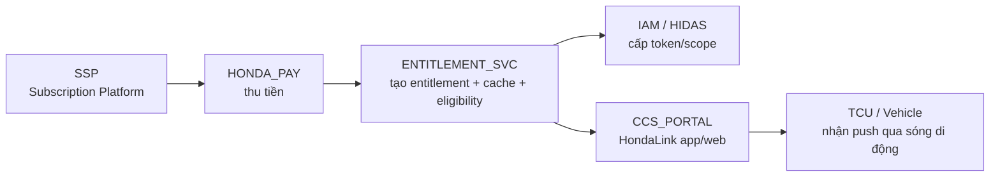
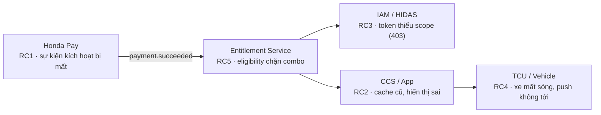
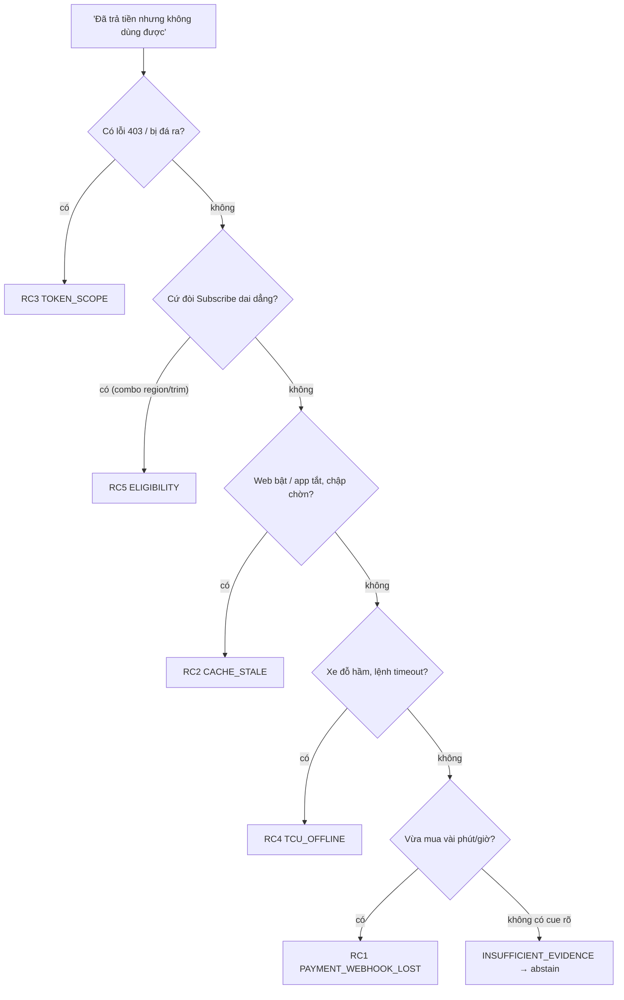
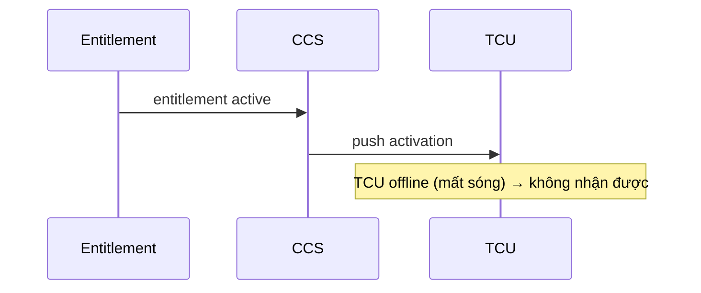
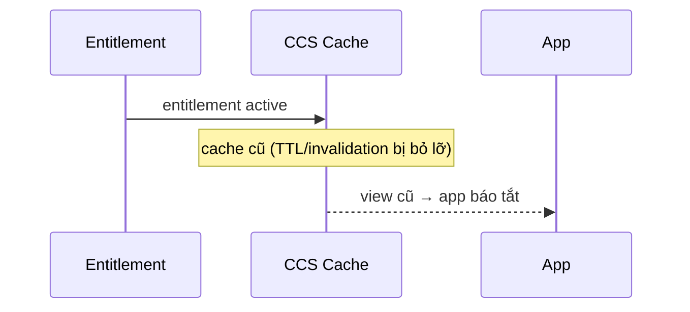
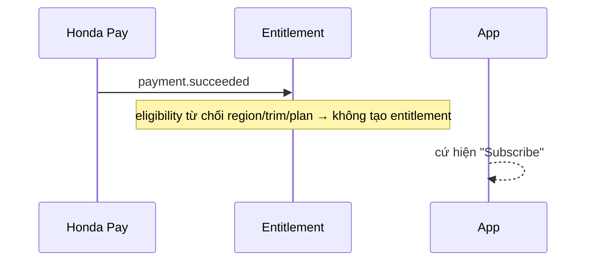
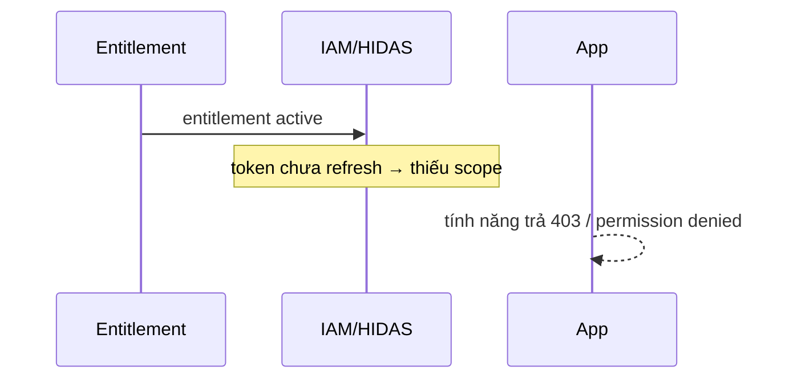
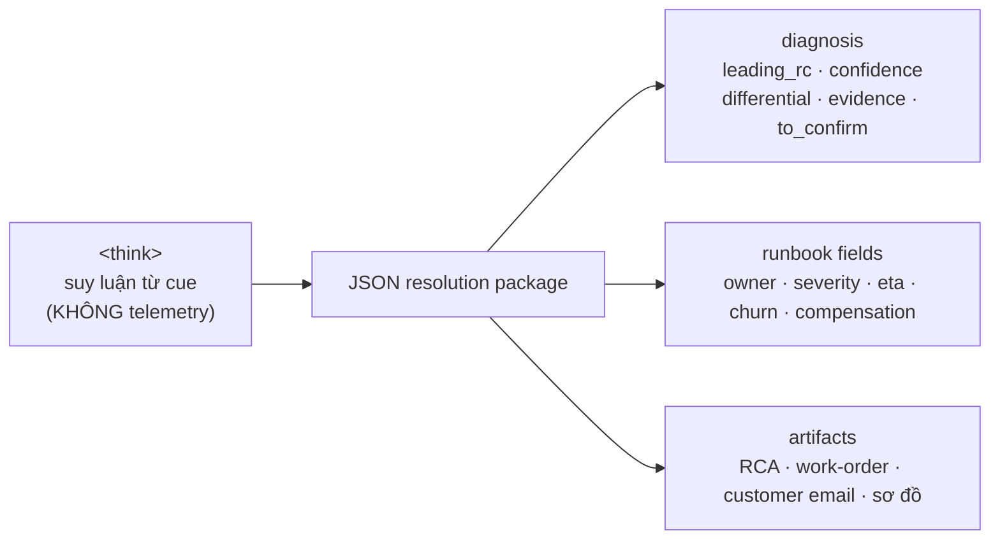
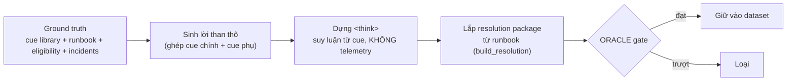

# Honda Entitlement Resolver — Slide nội dung (PoC6)

> File này để dựng slide. Mỗi `---` là một slide. Diagram viết bằng **mermaid** (render được trên
> Marp, reveal.js, HackMD, GitHub, hoặc dán vào https://mermaid.live).
> Nội dung CHỈ tập trung vào những điều **đặc biệt của case Honda**: 5 root cause, runbook, và
> cách dựng gold dataset — không nói về framework train/eval chung.

---

## 1 · Bài toán đặc biệt

**Một SLM chẩn đoán "closed-book" cho support Honda.**

- **Đầu vào** = lời than **thô** của khách (ngôn ngữ tự nhiên) — **KHÔNG có mã lỗi, KHÔNG có log,
  KHÔNG có telemetry**.
- Model chỉ đọc **cue ngôn ngữ** trong lời than → suy ra **root cause** → xuất **gói xử lý**.
- **Đóng (closed-book):** không gọi tool, không tra cứu hệ thống, không bịa số liệu.
- Điểm khó: nhiều sự cố **giống hệt nhau ở bề mặt** ("đã trả tiền mà không dùng được") nhưng
  **nguyên nhân khác nhau** — chỉ phân biệt được nhờ một vài **cue** nhỏ.

> Khác với chatbot RAG (chép ticket gần giống): ở đây model phải **đọc cue + suy luận có hiệu chỉnh
> độ tự tin + biết từ chối (abstain)** khi không đủ thông tin.

---

## 2 · Kiến trúc hệ thống — chuỗi phụ thuộc 6 node

Mỗi root cause = **một điểm gãy khác nhau** trên cùng một chuỗi kích hoạt subscription.

| Node | Vai trò | Đội sở hữu |
|---|---|---|
| SSP | Quản lý gói (Sport / Elite / Touring) | DSD Product |
| HONDA_PAY | Thu tiền, phát `payment.succeeded` | DSD Payments |
| ENTITLEMENT_SVC | Tạo entitlement, chạy eligibility, giữ cache | Entitlement Platform |
| IAM / HIDAS | Cấp token + scope theo entitlement | HG Identity |
| CCS_PORTAL | UI khách, đọc entitlement qua cache | DSD Digital Experience |
| TCU / Vehicle | Bộ thu trên xe, nhận push qua cellular | HG Connected Vehicle |

---

## 3 · 5 Root Cause — bản đồ điểm gãy

| # | Root cause | Runbook | Gãy ở đâu | Cue đặc trưng |
|---|---|---|---|---|
| RC-1 | `PAYMENT_WEBHOOK_LOST` | RB-PAY-01 | Pay → Entitlement | vừa mua (phút/giờ), charge pending |
| RC-2 | `ENTITLEMENT_CACHE_STALE` | RB-CACHE-02 | Entitlement/CCS cache | web bật, app tắt · chập chờn · re-login đỡ |
| RC-3 | `TOKEN_SCOPE` | RB-IAM-03 | IAM / HIDAS | lỗi **403** / bị đá ra khi mở tính năng |
| RC-4 | `TCU_OFFLINE` | RB-TCU-04 | TCU / xe | đỗ hầm/mất sóng · lệnh spin rồi timeout |
| RC-5 | `ELIGIBILITY_RULE_CONFLICT` | RB-ELIG-05 | Entitlement (eligibility) | cứ đòi **Subscribe** dù đã trả · combo region/trim/plan |

**+ Lớp thứ 6: `INSUFFICIENT_EVIDENCE`** — không đủ cue → **abstain**, định tuyến cho người.

---

## 4 · Điểm tinh tế: cùng bề mặt, khác cue

Mọi ca đều mở đầu giống nhau — *"tôi trả tiền rồi mà không dùng được"*. Cue mới quyết định RC:

> Quy tắc phân biệt cốt lõi: **cache stale** = entitlement CÓ tồn tại (active đâu đó); **eligibility**
> = active **không ở đâu cả**, app cứ đòi mua. **TCU offline** = app báo active nhưng **xe** timeout.

---

## 5 · RC-4 TCU_OFFLINE (RB-TCU-04)

**Một dòng:** Subscription active nhưng TCU mất sóng → xe chưa nhận push.

- **Cue:** xe đỗ hầm/underground nhiều ngày · lệnh remote spin rồi timeout · app báo active nhưng xe
  không phản hồi.
- **Severity** S4 (S3 nếu lỗi phần cứng) · **ETA** <15 phút khi xe có sóng lại.
- **Hướng xử lý khách:** đưa xe ra chỗ thoáng, nổ máy vài phút để bắt sóng → tự sync.

---

## 6 · RC-2 ENTITLEMENT_CACHE_STALE (RB-CACHE-02)

**Một dòng:** Entitlement đã tạo nhưng cache app/CCS chưa refresh → app hiển thị thiếu.

- **Cue:** web báo active, app báo tắt · chập chờn/flicker · log out–in đỡ một lúc.
- **Severity** S3 · **ETA** <30 phút (thường tức thì sau invalidation).
- **Hướng xử lý khách:** pull-to-refresh hoặc đăng xuất/đăng nhập lại.

---

## 7 · RC-5 ELIGIBILITY_RULE_CONFLICT (RB-ELIG-05)

**Một dòng:** Webhook tới nhưng eligibility từ chối combo region/trim/plan → không tạo entitlement.

- **Cue:** cứ đòi Subscribe dù đã trả · combo bị giới hạn (trim mới, region hẹp, plan cao) · xảy ra
  **ngay và dai dẳng**, không chập chờn.
- **Ma trận eligibility** (ground truth) — ví dụ "bẫy": **US-West + CR-V 2025 + Touring** → ngoài combo → RC-5.
- **Severity** S3 (S2 nếu cả region/combo) · **ETA** 2-3 giờ (đổi config matrix + replay).
- **Đặc biệt:** churn **medium-high** → **chủ động** tặng 1 tháng credit; **tuyệt đối không bảo khách mua lại**.

---

## 8 · RC-1 PAYMENT_WEBHOOK_LOST · RC-3 TOKEN_SCOPE

**RC-1 (RB-PAY-01):** đã thu tiền nhưng sự kiện payment→entitlement không hoàn tất → chưa tạo entitlement.
- Cue: vừa mua (phút/giờ) · charge pending/processing · thường **tự khỏi** sau ít phút.
- Phân biệt với RC-5: RC-5 là **rule chặn dai dẳng**; RC-1 gắn với **mua rất gần đây**, hay tự settle/replay.

**RC-3 (RB-IAM-03):** entitlement có, nhưng token IAM/HIDAS thiếu scope → tính năng trả **403**.
- Cue: **403/permission denied** khi mở tính năng · bị **đá ra** · đăng nhập bình thường nhưng tính năng bị chặn.
- Phân biệt với RC-2: cache = báo *thiếu/tắt*; token-scope = báo *lỗi quyền* (403) rõ ràng.

---

## 9 · Abstention — biết "không đủ thông tin để đoán"

`INSUFFICIENT_EVIDENCE` khi: **không có cue phân biệt** hoặc **ngoài catalog**.

- **Mơ hồ:** *"It just doesn't work. I paid for it and nothing happens."* → không 1 cue nào.
- **Ngoài catalog:** đòi refund/dispute · app crash khi mở · OTA update kẹt → KHÔNG phải 1 trong 5 RC.
- Hành vi đúng: **confidence thấp (≤0.45)**, không ép RC, **định tuyến người thật (DSD L2 triage)**,
  liệt kê "cần xác minh".

> Đây là điểm phân biệt với RAG baseline: RAG **không bao giờ abstain** — luôn chép RC của ticket gần nhất
> (sai khi cue bị "lật").

---

## 10 · Runbook — tạo thế nào & gồm gì

Runbook là **nguồn chân lý** (single source of truth). 5 runbook, mỗi RC một cái, là **dict có cấu trúc**
~20 trường (`ground_truth.py` §2.1) → `render_runbook()` xuất ra tài liệu Markdown chuẩn.

**Nhóm trường — và ai được thấy:**

| Nhóm | Trường | Dành cho |
|---|---|---|
| Định danh | `runbook_id`, `title`, `rc_class` | nội bộ |
| Giải thích | `one_line`, `summary`, `why_plain`, `why_technical` | `why_plain` → khách; còn lại nội bộ |
| Sở hữu | `owner_team`, `support_contact`, `escalation` | nội bộ |
| Phát hiện | `detection_cues`, `confirm_checks` | nội bộ |
| Khắc phục | `fix_steps` | nội bộ |
| SLA/mức độ | `eta_ttr`, `severity`, `priority` | nội bộ (ETA có thể cho khách) |
| Kinh doanh | `churn_risk`, `compensation_policy` | nội bộ |
| Giao tiếp | `customer_communication`, `customer_action` | `customer_action` → khách |
| Truy nguyên | `similar_incident`, `last_reviewed` | nội bộ |

> Nguyên tắc: facts **chỉ** sống trong runbook — code/model **không bịa**; UI tách rõ phần **gửi khách**
> với phần **nội bộ**.

---

## 11 · Ví dụ runbook đầy đủ — RB-ELIG-05

- **why_plain (cho khách):** *"Thanh toán của bạn đã thành công, nhưng một quy tắc kích hoạt nội bộ
  chặn đúng combo xe/khu vực/gói của bạn — lỗi ở phía chúng tôi, đang khắc phục."*
- **why_technical (nội bộ):** payment.succeeded đã tới, eligibility từ chối region/trim/plan → không
  tạo entitlement → không lan xuống IAM/CCS/TCU.
- **fix_steps:** lấy eligibility decision → đối chiếu ma trận → cập nhật matrix → replay tạo entitlement
  → verify → audit khách cùng combo.
- **owner:** Entitlement Platform · **escalation:** DSD L2 → L3 nếu cần deploy.
- **churn:** medium-high · **compensation:** chủ động 1 tháng credit; >48h → 3 tháng + thư xin lỗi.
- **customer_action (cho khách):** *"Bạn không cần làm gì; chúng tôi đang sửa quy tắc và xác nhận trong 24h."*

---

## 12 · Sub-cause — chiều sâu trong mỗi RC

RC là **lớp phân loại theo cue**; mỗi RC còn có nhiều **failure mode (sub_cause)** cụ thể.
`why_technical / fix_steps / severity / eta_ttr` **đổi theo sub_cause**, còn owner/runbook **giữ nguyên**.

| RC | Một số sub-cause |
|---|---|
| TCU_OFFLINE | no_signal_garage · weak_signal · tcu_asleep · firmware_hang · **hardware_fault (RMA)** · low_12v · carrier_outage |
| CACHE_STALE | app_client_cache · ccs_server_ttl · cdn_edge · multi_device_lag · invalidation_missed |
| ELIGIBILITY | region/trim/plan_not_in_matrix · **matrix_stale_new_model_year (S2)** · **rule_misconfig_bug (S2)** · promo_bundle_edge |
| PAYMENT_WEBHOOK | webhook_delayed · webhook_dropped · pending_review · duplicate_charge · partial_provision |
| TOKEN_SCOPE | stale_scope · token_expired · **scope_mapping_bug (S2)** · multi_account_mismatch |

> Ví dụ: TCU `hardware_fault` → ETA "RMA vài ngày" + rung escalation đổi sang "kiểm tra phần cứng",
> thay vì "đưa xe ra chỗ thoáng".

---

## 13 · Gói xử lý đầu ra (resolution package)

Mỗi ca, model xuất **`<think>` + một JSON** đúng schema §3.2 — lắp từ runbook, không bịa:

- **diagnosis:** RC dẫn đầu + confidence **đã hiệu chỉnh** + differential + cue đọc được + cần xác minh.
- **artifacts:** RCA, phiếu xử lý, **email khách** (chỉ giọng khách), sơ đồ mermaid.

---

## 14 · Gold dataset dựng từ runbook thế nào

Toàn bộ data sinh từ ground truth + **oracle chấm cổng** (gate) từng mẫu:

**Oracle chấm gì (cổng chất lượng):**
1. **Cue-grounding** — mọi `evidence_in_ticket` phải có trong lời than (không bịa cue).
2. **No fabricated telemetry** — `<think>` KHÔNG được khẳng định số liệu hệ thống.
3. **RC ↔ cue khớp** · **runbook fidelity** (field khớp gold).
4. **Calibration** — confidence ≤ 0.85 từ lời than; abstain ≤ 0.45.

---

## 15 · "No fabricated telemetry" — ràng buộc chữ ký của case

Model **không có log** → tuyệt đối không được "bịa" đã thấy số liệu. Oracle quét regex chặn các mẫu:

- `T+28s`, `delivered at ...`, `record (not) found`
- `webhook delivered/received/fired/succeeded`
- `last_seen = 2026-...`, timestamp `2026-06-30 14:03`, `2:05 pm`
- `eligibility_decision = not_eligible`

→ `<think>` chỉ được nói **giả thuyết** ("có lẽ webhook bị chặn…"), **không** khẳng định sự kiện.
Đây là **KPI trung thực số 1** (mục tiêu ≥98%).

---

## 16 · Bộ data: 5 nhóm SFT + 6 loại DPO (chống đúng các lỗi nguy hiểm)

**5 nhóm SFT** (đều dựng từ runbook qua oracle):
1. complaint → resolution (ca chính)
2. **knowledge augmentation** — nhồi field runbook, hỏi 2 chiều
3. **differential reasoning** — ít cue hơn → ép cân nhắc trade-off
4. **distractors** — cùng bề mặt, khác cue → chống "luôn đoán 1 RC"
5. **abstention** — mơ hồ / ngoài catalog

**6 loại cặp DPO** (dạy model tránh lỗi): `cue_dropped` · `fabricated_telemetry` · `overconfident` ·
`missing_fields` · `forced_guess` · `overpromise` · `single_path`.

**eval_hard:** 20 lời than **thật, lộn xộn**, cue giấu trong nhiễu (viết tay, seed tách hẳn data train).

---

## 17 · Tóm tắt — điểm đặc biệt của case Honda

- **Closed-book chẩn đoán từ lời than thô** — đọc **cue**, không log, không tool.
- **5 RC trên 1 chuỗi 6 node** — cùng bề mặt "đã trả tiền mà không dùng được", phân biệt bằng cue.
- **Differential + confidence hiệu chỉnh + abstention** — biết từ chối khi thiếu cue.
- **Runbook = nguồn chân lý**, có chiều sâu **sub-cause**; tách rõ **khách vs nội bộ**.
- **Trung thực tuyệt đối:** không bịa telemetry — enforced bằng **oracle** ở khâu sinh data.
- **Gold dataset 100% sinh từ runbook + oracle-gated** → fact không trôi.
